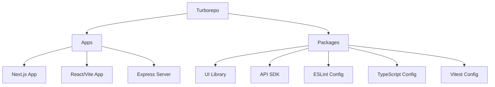

# Turborepo Playground

A modern monorepo architecture showcasing best practices for frontend development with React, Next.js, and Node.js.

## Architecture Overview



This project demonstrates a modern monorepo architecture using Turborepo, with shared packages and multiple applications that showcase different frontend frameworks and patterns.

## Key Features

- **Monorepo Structure**: Organized with Turborepo for efficient workspace management
- **Multiple Frontend Implementations**:
  - React app with Vite
  - Next.js app
- **Backend API**: Express server with PostgreSQL (NeonDB)
- **Shared Component Library**: Reusable UI components with Radix UI primitives
- **API Layer**: OpenAPI-driven development with automatic client generation
- **Mock Service Worker Integration**: Seamless API mocking for development and testing
- **Consistent Configuration**: Shared ESLint, TypeScript, and testing configurations
- **Modern Styling**: SCSS modules with utility functions

## Tech Stack

### Core Technologies

- **Build System**: [Turborepo](https://turbo.build/)
- **Package Manager**: [Bun](https://bun.sh/)
- **Languages**: TypeScript, SCSS

### Frontend

- **Frameworks**: React 19, Next.js 15
- **Build Tools**: Vite 6
- **Data Fetching**: TanStack Query (React Query)
- **UI Components**: Radix UI primitives
- **Styling**: SCSS Modules, Open Props

### Backend

- **Server**: Express.js
- **Database**: PostgreSQL (NeonDB)
- **API**: OpenAPI 3.1

### Testing & Development

- **Testing**: Vitest, React Testing Library
- **API Mocking**: Mock Service Worker (MSW)
- **Documentation**: Ladle (component stories)
- **Code Quality**: ESLint, TypeScript strict mode
- **Dependency Management**: Syncpack

## Getting Started

### Prerequisites

- Node.js >= 18
- Bun >= 1.2.2

### Installation

```bash
# Clone the repository
git clone https://github.com/vincentbollaert/turborepo-playground.git
cd turborepo-playground

# Install dependencies
bun install

# Start development servers
bun run dev
```

## Development Workflow

### Running Apps

```bash
# Run all apps and packages in development mode
bun run dev

# Run specific app
bun run dev --filter=client-react
bun run dev --filter=client-next
bun run dev --filter=server
```

### Building

```bash
# Build all apps and packages
bun run build

# Build specific app or package
bun run build --filter=client-react
```

### Testing

```bash
# Run tests across all packages
bun run test

# Run tests for a specific package
bun run test --filter=client-react
```

## Testing Strategy

This project uses a comprehensive testing approach:

- **Integration Tests**: Testing components with their data fetching logic
- **Component Tests**: Isolated UI component testing
- **Mock Service Worker**: API mocking for predictable test scenarios
- **Test Utilities**: Shared test setup and utilities

## Project Structure

```
.
├── apps/                      # Application packages
│   ├── client-next/           # Next.js application
│   ├── client-react/          # React application with Vite
│   └── server/                # Express API server
├── packages/                  # Shared packages
│   ├── api/                   # API client, types, and mocks
│   ├── eslint-config/         # Shared ESLint configurations
│   ├── typescript-config/     # Shared TypeScript configurations
│   ├── ui/                    # Shared UI component library
│   └── vitest-config/         # Shared Vitest configuration
├── package.json               # Root package.json
└── turbo.json                 # Turborepo configuration
```

### Key Packages

#### UI Library

The UI library is organized into:

- **Primitives**: Low-level UI building blocks
- **Components**: Reusable UI components
- **Patterns**: Higher-level UI patterns
- **Templates**: Page templates and layouts

#### API Package

The API package provides:

- OpenAPI schema
- Generated API clients
- React Query hooks
- MSW handlers for mocking
- Utility functions

## Learning Resources

This project demonstrates several modern frontend architecture concepts:

1. **Monorepo Management**

   - Workspace dependencies
   - Shared configuration
   - Build caching and optimization

2. **Component Library Design**

   - Component hierarchy (primitives → components → patterns → templates)
   - Styling strategies
   - Component documentation

3. **API Integration**

   - Schema-first API development
   - Type-safe API clients
   - API mocking strategies

4. **Testing Strategies**
   - Component testing
   - Integration testing
   - Mock data management

---

Project by [Vincent Bollaert](https://github.com/vincentbollaert)
