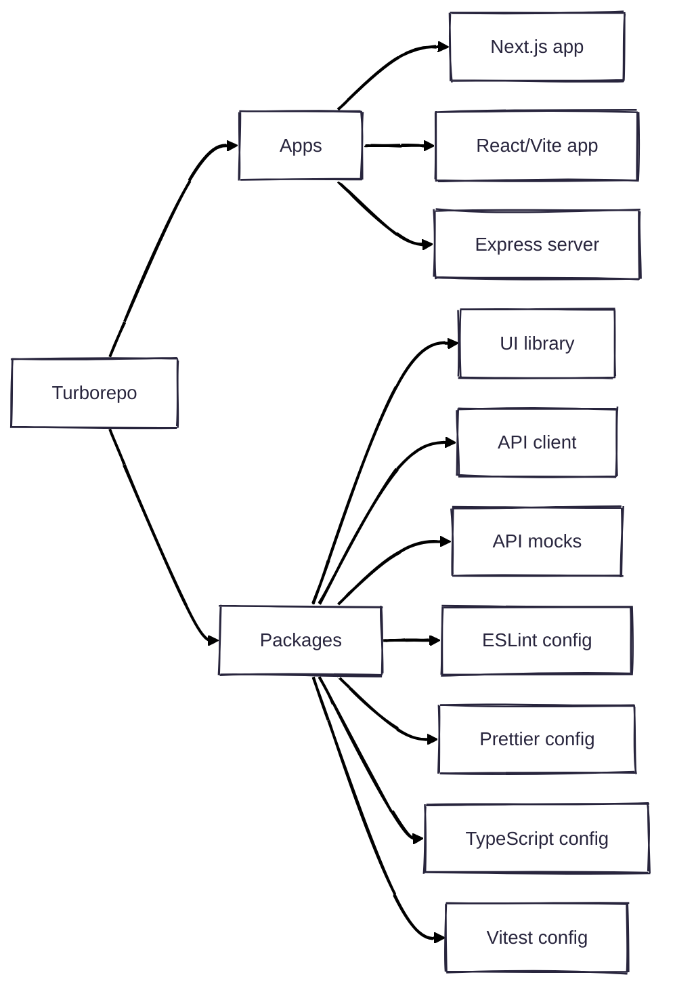

# Turborepo Playground

A monorepo architecture showcasing my current practices for stitching together React, Next.js, and Node.js applications

## Screenshot


## Architecture Overview



## Key Features

- **Monorepo Structure**: Organized with Turborepo for efficient workspace management
- **Multiple Frontend Implementations**:
  - React app with Vite
  - Next.js app
- **Backend API**: Express server with PostgreSQL (NeonDB)
- **Shared Component Library**: Reusable UI components with Radix UI primitives
- **API Layer**: OpenAPI-driven development with automatic client generation
- **Mock Service Worker Integration**: Seamless API mocking for development and testing
- **Consistent Configuration**: Shared ESLint, TypeScript, and testing configurations
- **Modern Styling**: SCSS modules with open-props and utility classes

## Tech Stack

### Core Technologies

- **Build System**: [Turborepo](https://turbo.build/)
- **Package Manager**: [Bun](https://bun.sh/)
- **Languages**: [TypeScript](https://www.typescriptlang.org/), [SCSS](https://sass-lang.com/)

### Frontend

- **Frameworks**: [React 19](https://react.dev/), [Next.js 15](https://nextjs.org/)
- **Build Tools**: [Vite 6](https://vitejs.dev/)
- **Data Fetching**: [TanStack Query](https://tanstack.com/query/latest) (React Query)
- **UI Components**: [Radix UI](https://www.radix-ui.com/) primitives
- **Styling**: [SCSS Modules](https://github.com/css-modules/css-modules), [Open Props](https://open-props.style/)

### Backend

- **Server**: [Express.js](https://expressjs.com/)
- **Database**: [PostgreSQL](https://www.postgresql.org/) ([NeonDB](https://neon.tech/))
- **API**: [OpenAPI 3.1](https://spec.openapis.org/oas/v3.1.0)

### Testing & Development

- **Testing**: [Vitest](https://vitest.dev/), [React Testing Library](https://testing-library.com/docs/react-testing-library/intro)
- **API Mocking**: [Mock Service Worker](https://mswjs.io/) (MSW)
- **Documentation**: [Ladle](https://ladle.dev/) (component stories)
- **Code Quality**: [ESLint](https://eslint.org/), TypeScript strict mode
- **Dependency Management**: [Syncpack](https://github.com/JamieMason/syncpack)

## Getting Started

### Prerequisites

- [Node.js](https://nodejs.org/) >= 18
- [Bun](https://bun.sh/) >= 1.2.2

### Installation

```bash
# Clone the repository
git clone https://github.com/vincentbollaert/turborepo-playground.git
cd turborepo-playground

# Install dependencies
bun install

# Start development servers
bun run dev
```

## Development Workflow

### Running Apps

```bash
# Run all apps and packages in development mode
bun run dev

# Run specific app
bun run dev --filter=client-react
bun run dev --filter=client-next
bun run dev --filter=server
```

### Building

```bash
# Build all apps and packages
bun run build

# Build specific app or package
bun run build --filter=client-react
```

### Testing

```bash
# Run tests across all packages
bun run test

# Run tests for a specific package
bun run test --filter=client-react
```

## Testing Strategy

This project uses the foundations of a comprehensive testing approach:

- **Integration Tests**: Testing components with their data fetching logic
- **Mock Service Worker**: API mocking for predictable test scenarios
- **Test Utilities**: Shared test setup and utilities

## Project Structure

```
.
├── apps/                      # Application packages
│   ├── client-next/           # Next.js application
│   ├── client-react/          # React application with Vite
│   └── server/                # Express API server
├── packages/                  # Shared packages
│   ├── api/                   # API client and types
│   ├── api-mocks/             # API mocks and handlers
│   ├── ui/                    # Shared UI component library
│   ├── eslint-config/         # Shared ESLint configurations
│   ├── typescript-config/     # Shared TypeScript configurations
│   ├── prettier-config/       # Shared prettier configurations
│   └── vitest-config/         # Shared Vitest configuration
├── package.json               # Root package.json
└── turbo.json                 # Turborepo configuration
```

### Key Packages

#### UI Library

The UI library is organized into:

- **Primitives**: Low-level UI building blocks
- **Components**: Reusable UI components
- **Patterns**: Higher-level UI patterns
- **Templates**: Page templates and layouts

#### API Package

The API package provides:

- OpenAPI schema
- Generated API clients

#### API Mocks Package

The API package provides:

- MSW handlers for mocking
- Mocks

## Learning Resources

This project demonstrates several modern frontend architecture concepts:

1. **Monorepo Management**

   - Workspace dependencies
   - Shared configuration
   - Build caching and optimization

2. **Component Library Design**

   - Component hierarchy (primitives → components → patterns → templates)
   - Styling strategies (hierarchical design tokens)
   - Component documentation with Ladle (Storybook alternative)

3. **API Integration**

   - Schema-first API development
   - Type-safe API clients
   - API mocking strategies

4. **Testing Strategies**
   - Integration testing
   - Mock data management

---

Project by [Vincent Bollaert](https://github.com/vincentbollaert)
